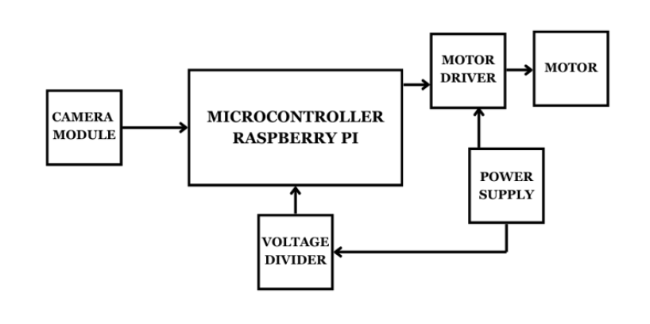
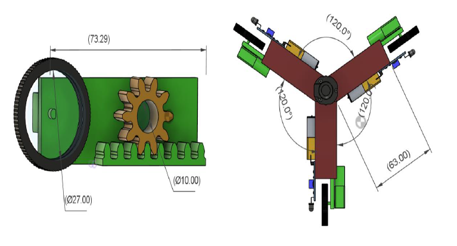
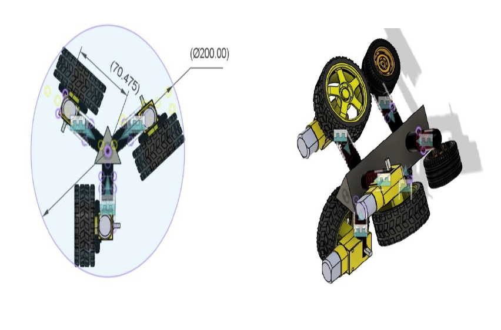
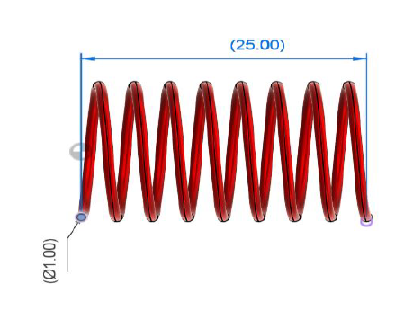
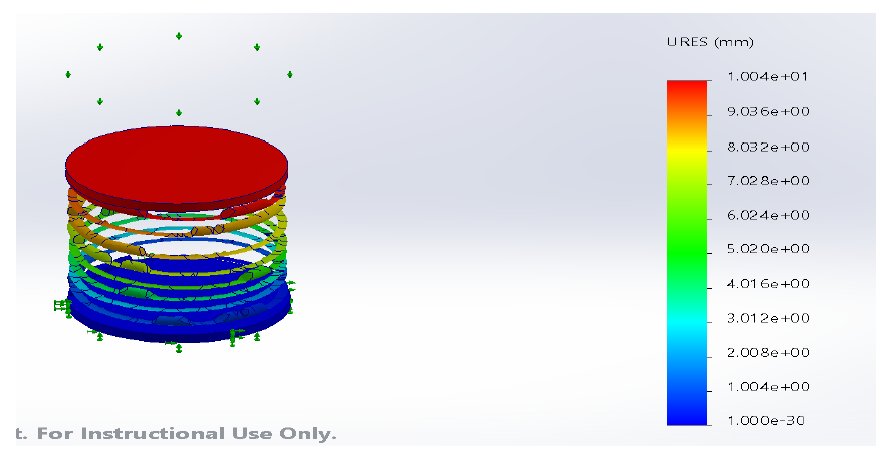
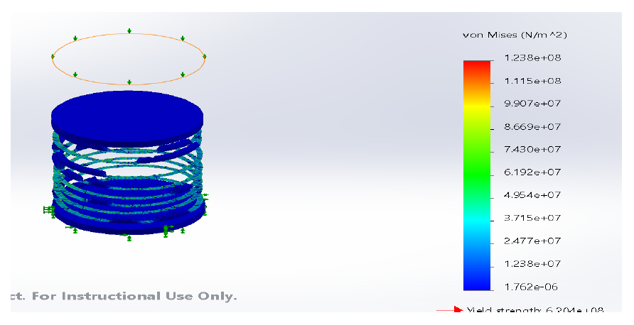

# 🚀 Design and Development of an In-Pipe Inspection Robot

> **Academic Team Project | Mechanical Design | Robotics | Mechatronics Engineering**

A compact and lightweight robotic system developed for inspecting **small-diameter (6–8 inch) cylindrical pipelines**. The robot uses a spring-loaded tri-wheel mechanism to achieve stable navigation inside pipelines while carrying a camera for internal inspection.

This repository is maintained by **Deebishaa S** as part of my engineering portfolio to showcase my work and contributions to this academic project.

---

# 📖 Project Overview

Industrial pipelines require periodic inspection to identify defects such as corrosion, cracks, leakages, and blockages. Conventional inspection methods are often expensive, time-consuming, and unsafe in confined environments.

This project presents the design and development of a compact in-pipe inspection robot capable of travelling through **6–8 inch pipelines** using a spring-loaded traction mechanism. The system was designed using CAD tools, validated through simulations, and implemented as a working prototype.

---

# ❗ Problem Statement

Existing inspection robots are generally designed for larger pipelines and have limited adaptability to smaller pipe diameters.

The objective of this project was to design a compact, lightweight, and reliable robotic platform capable of stable movement inside small-diameter cylindrical pipelines for visual inspection applications.

---

# 🎯 Objectives

- Design a compact inspection robot
- Navigate inside 6–8 inch pipelines
- Maintain continuous wheel contact using spring-loaded arms
- Improve traction and stability
- Develop a lightweight modular structure
- Enable real-time visual inspection

---

# ⚙️ System Architecture

---

# 🏗️ Design Evolution

## Initial Design

The first concept employed a rack-and-pinion based adjustable mechanism for adapting to varying pipe diameters.

---

## Final Design

The final design adopted spring-loaded arms with rear support wheels, resulting in improved traction, simplified construction, and better adaptability.

---

# 🔩 Spring-Loaded Traction Mechanism

A spring-loaded wheel mechanism was designed to maintain continuous contact with the inner surface of the pipeline.

The design improved

- Stability
- Adaptability
- Traction
- Ease of manufacturing

---

# 🤖 Prototype

A functional prototype was fabricated to validate the proposed design.

The prototype integrates

- DC geared motors
- Spring-loaded wheel assembly
- Camera mounting arrangement
- Lightweight chassis

---

# 📊 Engineering Analysis

The robot design was validated using engineering calculations including

- Spring stiffness
- Spring force
- Weight estimation
- Torque calculation
- Material selection
- Structural validation

---

# 🧪 Simulation Results

### Deformation Analysis

The deformation analysis verified the structural integrity of the spring mechanism under expected operating loads.

---

### Stress Analysis

Stress analysis confirmed that the selected spring configuration operates within acceptable limits.

---

# 🛠️ Technologies Used

| Category | Tools |
|----------|--------|
| CAD | Fusion 360 |
| Simulation | SolidWorks |
| Components | DC Motors, Springs, Wheels |
| Camera | Raspberry Pi Camera |
| Manufacturing | 3D Printing |
| Engineering | Mechanical Design, Material Selection |

---

# ✨ Key Features

- Compact design for 6–8 inch pipelines
- Spring-loaded traction mechanism
- Lightweight modular construction
- Stable horizontal and vertical navigation
- Real-time inspection capability
- Engineering validated design
- Prototype developed and tested

---

# 👩‍💻 My Contributions

This repository showcases **my contributions** to the academic project.

My major responsibilities included:

- Mechanical design and concept development
- Fusion 360 CAD modelling
- Design optimization
- Engineering calculations
- Material selection
- Prototype fabrication and assembly
- Mechanical testing and validation
- Technical documentation

---

# 🌍 Applications

- Water distribution pipelines
- Oil & Gas industries
- Chemical process plants
- Sewer inspection
- Industrial maintenance
- Robotics research

---

# 🚀 Future Improvements

Future enhancements include

- Wireless control
- Autonomous navigation
- AI-based defect detection
- SLAM mapping
- Ultrasonic crack detection
- Thermal imaging
- IoT monitoring
- Waterproof enclosure

---

# 🎓 Academic Project Information

This project was completed as part of the **B.Tech Mechatronics Engineering** curriculum at **SASTRA Deemed University** during the academic year **2024–2025**.

### Team Members

- Deebishaa S
- Dhivya A
- Sanddhya G

### Faculty Supervisor

Dr. R. M. Kuppan Chetty

Professor

School of Mechanical Engineering

SASTRA Deemed University

---

# 👤 Repository Owner

**Deebishaa S**

B.Tech Mechatronics Engineering

This repository is maintained as part of my professional engineering portfolio.

---

# 📌 Disclaimer

This repository showcases my contributions to an academic team project completed as part of the B.Tech Mechatronics Engineering curriculum. It is intended for educational and portfolio purposes, with due acknowledgment to the project team and faculty supervisor.
