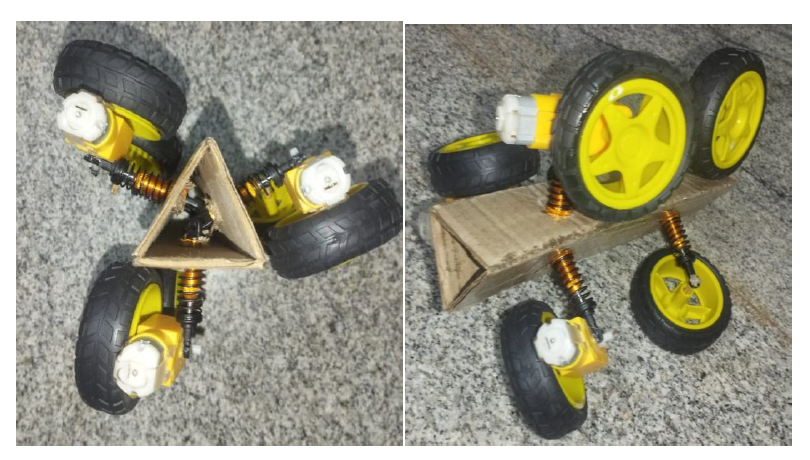

# 🚀 Design and Development of an In-Pipe Inspection Robot

> **Academic Engineering Project | Mechatronics | Robotics | Mechanical Design**

A compact and lightweight robotic system designed for inspecting **small-diameter (6–8 inch) cylindrical pipelines**. The robot utilizes a spring-loaded tri-wheel mechanism to provide stable movement inside pipelines while carrying a camera for internal visual inspection.

This repository is maintained by **Deebishaa S** as part of my engineering portfolio to showcase my contributions to the project.

---

# 📖 Project Overview

Pipeline inspection is essential for identifying corrosion, cracks, leakages, and blockages in industrial pipelines. Traditional inspection methods are often expensive, time-consuming, and difficult to perform in confined spaces.

This project presents the design and development of a compact in-pipe inspection robot capable of travelling inside **6–8 inch pipelines**. The robot employs a spring-loaded wheel mechanism that maintains continuous contact with the inner pipe surface, ensuring stable navigation in both horizontal and vertical orientations.

The mechanical design was developed using CAD software, validated through engineering simulations, and implemented as a working prototype.

---

# ❗ Problem Statement

Industrial pipelines require periodic inspection to ensure operational safety and reliability. Existing inspection robots are often designed for larger pipelines and are not suitable for smaller diameters.

The objective of this project was to develop a compact, lightweight, and reliable robotic platform capable of inspecting small-diameter cylindrical pipelines while maintaining stability and traction throughout its movement.

---

# 🎯 Objectives

- Design a compact in-pipe inspection robot.
- Navigate efficiently inside 6–8 inch cylindrical pipelines.
- Maintain continuous wheel contact using a spring-loaded mechanism.
- Improve stability and traction during movement.
- Develop a lightweight and modular robotic structure.
- Enable real-time visual inspection using a camera module.

---

# ⚙️ System Architecture

---

# 🏗️ Mechanical Design Evolution

## Initial Design

The initial concept employed a rack-and-pinion based adjustable mechanism for adapting to different pipe diameters.

---

## Final Design

The final design replaced the rack-and-pinion mechanism with spring-loaded arms, improving adaptability, reducing mechanical complexity, and enhancing overall stability.

---

# 🔩 Spring-Loaded Traction Mechanism

The spring-loaded wheel assembly maintains continuous contact with the inner surface of the pipeline.

This mechanism improves:

- Stable navigation
- Wheel traction
- Adaptability to pipe variations
- Mechanical simplicity

---

# 🤖 Prototype

A functional prototype was fabricated to validate the proposed mechanical design.

The prototype incorporates:

- DC geared motors
- Spring-loaded wheel mechanism
- Camera mounting arrangement
- Lightweight chassis

---

# 📊 Engineering Analysis

The robot design was validated using engineering calculations and simulations.

Major analyses included:

- Spring stiffness calculation
- Spring force analysis
- Torque calculation
- Weight estimation
- Material selection
- Structural validation

---

# 🧪 Simulation Results

## Deformation Analysis

The deformation study verified that the spring mechanism can safely withstand expected operating loads.

---

## Stress Analysis

Stress analysis confirmed that the spring operates within acceptable stress limits, supporting reliable performance.

---

# 🛠️ Technologies Used

| Category | Tools / Components |
|----------|--------------------|
| CAD Design | Fusion 360 |
| Simulation | SolidWorks |
| Mechanical Components | DC Geared Motors, Springs, Wheels |
| Camera | Raspberry Pi Camera Module |
| Manufacturing | 3D Printing |
| Engineering | Mechanical Design, Engineering Calculations |

---

# ✨ Key Features

- Compact design for 6–8 inch pipelines
- Spring-loaded tri-wheel traction mechanism
- Lightweight modular construction
- Stable movement in horizontal and vertical pipelines
- Real-time inspection capability
- Engineering validated design
- Prototype development and testing

---

# 👩‍💻 My Contributions

This repository showcases my contributions to the project. My work included:

- Mechanical design and concept development
- CAD modelling
- Design optimization
- Engineering calculations
- Material selection
- Prototype fabrication and assembly
- Mechanical testing and validation
- Technical documentation

---

# 🌍 Applications

- Water distribution pipelines
- Oil & Gas industries
- Chemical processing plants
- Industrial maintenance
- Sewer inspection
- Robotics research and education

---

# 🚀 Future Improvements

Potential future enhancements include:

- Wireless remote control
- Autonomous navigation
- AI-based defect detection
- SLAM-based pipeline mapping
- Ultrasonic crack detection
- Thermal imaging camera
- IoT-based monitoring
- Waterproof enclosure

---

# 🎓 Academic Project

This project was completed as part of the **B.Tech Mechatronics Engineering** curriculum at **SASTRA Deemed University** under faculty supervision.

This repository has been created to showcase my engineering work and contributions as part of my professional portfolio.

---

# 👤 Repository Owner

**Deebishaa S**

B.Tech Mechatronics Engineering

---

# 📌 Disclaimer

This repository is intended solely for educational and portfolio purposes. It highlights my contributions to an academic engineering project and does not include the complete university project report or other academic submission materials.
